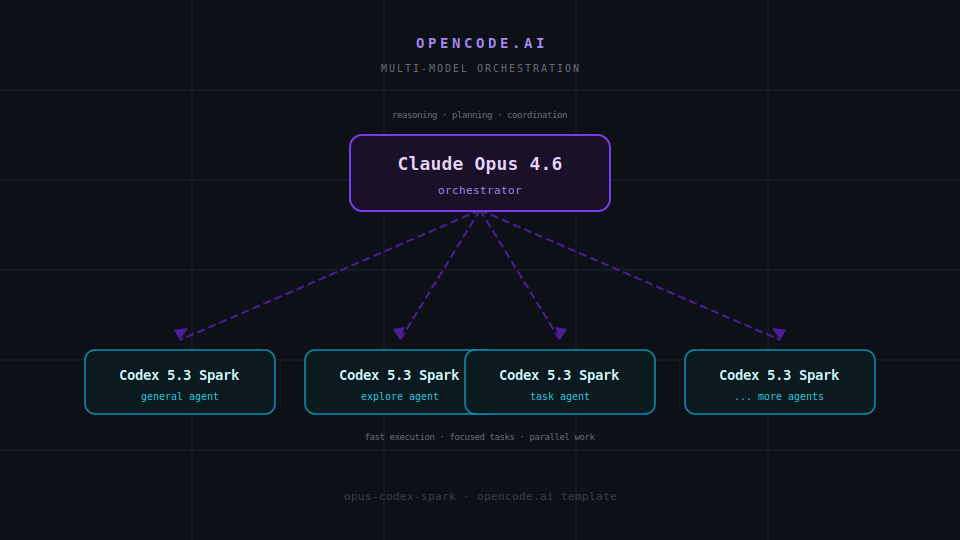

# opus-codex-spark

**A ready-to-use [opencode.ai](https://opencode.ai) template pairing Claude Opus 4.6 as the orchestrator with Codex 5.3 Spark as the fast sub-agent.**

<p align="center">
  
</p>

---

## What This Is

An opencode configuration template that sets up **multi-model orchestration** out of the box:

- **Claude Opus 4.6** handles reasoning, planning, and task coordination
- **Codex 5.3 Spark** runs focused sub-agent work (general, explore, task agents) in parallel

You clone it, run `opencode`, and you're working with a coordinated multi-model system immediately.

## How It Works

opencode lets you define **agents** -- persistent system prompts with model assignments. This template uses that to split work between two models:

```
                  ┌─────────────────────┐
                  │   Claude Opus 4.6   │
                  │    (orchestrator)    │
                  │                     │
                  │  reasoning, plans,  │
                  │   task delegation   │
                  └────────┬────────────┘
                           │
            ┌──────────────┼──────────────┐
            ▼              ▼              ▼
   ┌─────────────┐ ┌─────────────┐ ┌─────────────┐
   │ Codex Spark │ │ Codex Spark │ │ Codex Spark │
   │  (general)  │ │  (explore)  │ │   (task)    │
   │             │ │             │ │             │
   │ code edits  │ │ codebase    │ │ focused     │
   │ file writes │ │ search      │ │ sub-tasks   │
   └─────────────┘ └─────────────┘ └─────────────┘
```

Opus handles the hard thinking. Spark handles the volume. The result is fast, high-quality output.

## Config Breakdown

### `opencode.json`

The main config defines providers, models, and agent-to-model routing:

```jsonc
{
  // Default model for sub-agents
  "model": "openai/gpt-5.3-codex-spark",

  // The orchestrator agent starts by default
  "default_agent": "orchestrator",

  // Sub-agents all use Spark for speed
  "agent": {
    "general": { "model": "openai/gpt-5.3-codex-spark" },
    "explore": { "model": "openai/gpt-5.3-codex-spark" }
  }
}
```

### `.opencode/agents/orchestrator.md`

The orchestrator agent definition uses frontmatter to pin itself to Opus:

```markdown
---
description: Lightweight orchestrator for this repository.
mode: primary
model: anthropic/claude-opus-4-6
---

You are the Orchestrator agent.

Your job is to run short coordination loops:
1. Clarify the task and acceptance criteria.
2. Delegate when needed to subagents, otherwise implement directly.
3. Confirm completion with a quick validation check.
4. Report concise status and remaining risks.
```

The key line is `model: anthropic/claude-opus-4-6` -- this overrides the default Spark model so the orchestrator always runs on Opus, while every sub-agent it spawns uses Spark.

## Quick Start

```bash
# Clone the template
git clone https://github.com/jameslal/opus-codex-spark.git
cd opus-codex-spark

# Make sure opencode is installed
# https://opencode.ai for installation instructions

# Run it
opencode
```

That's it. The orchestrator agent loads automatically and you're working with the multi-model setup.

## Customizing

- **Swap models:** Change the `model` fields in `opencode.json` or `orchestrator.md` to use different providers/models
- **Add agents:** Create new `.md` files in `.opencode/agents/` with frontmatter to define specialized agents
- **Tune permissions:** The `permission` block in `opencode.json` controls what tools agents can use

---

Built with [opencode.ai](https://opencode.ai)
